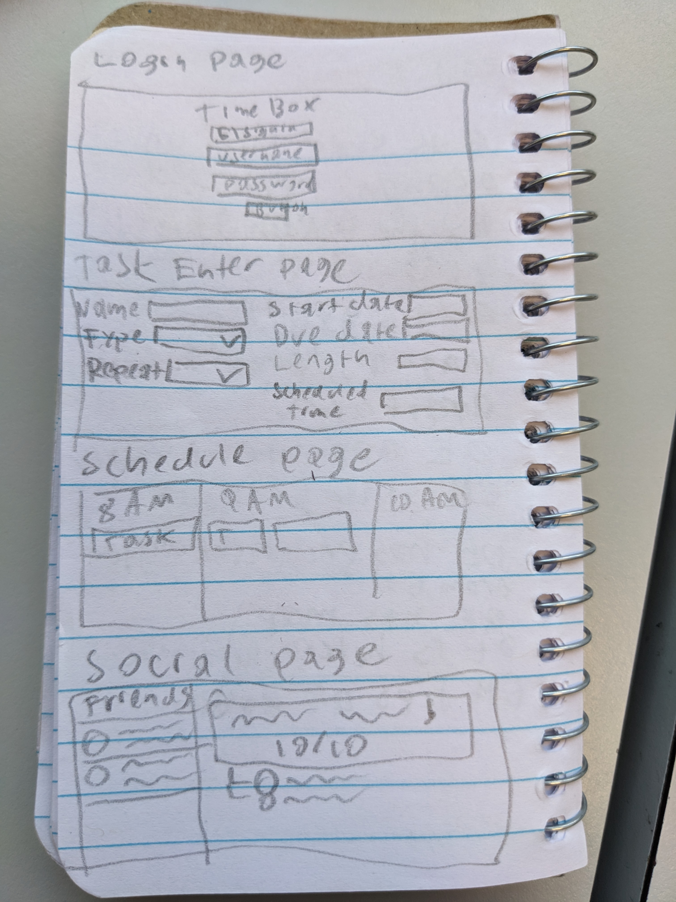

# Timebox - task management and scheduling

[My Notes](notes.md)

> [!NOTE]
>  This is a template for your startup application. You must modify this `README.md` file for each phase of your development. You only need to fill in the section for each deliverable when that deliverable is submitted in Canvas. Without completing the section for a deliverable, the TA will not know what to look for when grading your submission. Feel free to add additional information to each deliverable description, but make sure you at least have the list of rubric items and a description of what you did for each item.

> [!NOTE]
>  If you are not familiar with Markdown then you should review the [documentation](https://docs.github.com/en/get-started/writing-on-github/getting-started-with-writing-and-formatting-on-github/basic-writing-and-formatting-syntax) before continuing.

## 🚀 Specification Deliverable

> [!NOTE]
>  Fill in this sections as the submission artifact for this deliverable. You can refer to this [example](https://github.com/webprogramming260/startup-example/blob/main/README.md) for inspiration.

For this deliverable I did the following. I checked the box `[x]` and added a description for things I completed.

- [x] Proper use of Markdown
- [x] A concise and compelling elevator pitch
- [x] Description of key features
- [x] Description of how you will use each technology
- [x] One or more rough sketches of your application. Images must be embedded in this file using Markdown image references.

### Elevator pitch

Do you feel overwhelmed by all the tasks that you have to do? Do you have goals that you are struggling to achieve? Do you wonder each night where the day has gone? Perhaps Timebox is for you! Timebox combines scheduling and to-do lists to create a day-to-day plan for your life. It allows you to break down high-level goals into simple tasks, create atomic habits, budget your time, and even share your progress with friends. Take control of your time, with Timebox.

### Design

### Key features

- Secure login over HTTPS
- Allow user to enter in tasks
- Store database of user tasks persistently
- Generate a schedule for the day based on tasks
- Provide the user with feedback regarding tasks completed
- Allow for sharing of task completions with friends
- Store user messages and conversations

### Technologies

I am going to use the required technologies in the following ways.

- **HTML** - Structure of the application. Pages include login page, task enter page, schedule page, and social page.
- **CSS** - Style of the application. Used to create good visual appeal.
- **React** - Components for each page. Efficient updating of components with user input and routing (task selection, page changes)
- **Service** - Backend service with endpoints for:
    - login
    - entering tasks
    - retrieving tasks
    - sending user messages
    - retrieving user responses
    - API call to Google Calendar
    - Register, login, and logout users.
- **DB/Login** - Store users, tasks, and messages. Register and login users.
- **WebSocket** - Users are able to communicate with each other on public feeds.

## 🚀 AWS deliverable

For this deliverable I did the following. I checked the box `[x]` and added a description for things I completed.

- [x] **Server deployed and accessible with custom domain name** - [My server link](https://ryanrichards.click).

## 🚀 HTML deliverable

For this deliverable I did the following. I checked the box `[x]` and added a description for things I completed.

- [x] **HTML pages** - Four HTML pages: a main page with the user's schedule, a login page, a page to add tasks, and a chat page.
- [x] **Proper HTML element usage** - Body, header, footer, nav and main elements all properly used.
- [x] **Links** - Each page contains links to the other pages in the header. The login page links automatically to the main page.
- [x] **Text** - Textual content headers, user-generated textual content.
- [x] **3rd party API placeholder** - The finished application will retrieve information from Google Calendar to fill out the schedule.
- [x] **Images** - Images used for user avatars.
- [x] **Login placeholder** - Login page with input fields and submit button, as well as a placeholder to sign in with Google. Username placeholder in the header.
- [x] **DB data placeholder** - User tasks and message histories will be stored in a database.
- [x] **WebSocket placeholder** - As users submit messages to chat, the page will be updated in real-time to reflect the new messages.

## 🚀 CSS deliverable

For this deliverable I did the following. I checked the box `[x]` and added a description for things I completed.

- [x] **Header, footer, and main content body** - Each included
- [x] **Navigation elements** - I used the Bootstrap navbar.
- [x] **Responsive to window resizing** - Schedule changes to column view in portrait mode: taskbar shrinks into a drop-down.
- [x] **Application elements** - The schedule, task add and chat pages are all included.
- [x] **Application text content** - Consistent sans-serif font used across the site.
- [x] **Application images** - Profile images placed in circle cutouts.

## 🚀 React part 1: Routing deliverable

For this deliverable I did the following. I checked the box `[x]` and added a description for things I completed.

- [x] **Bundled using Vite** - Vite has been installed and used.
- [x] **Components** - Each HTML page was converted into a component.
- [x] **Router** - Clicking on the navbar dynamically loads pages without the need for repeated code for the header and footer.

## 🚀 React part 2: Reactivity deliverable

For this deliverable I did the following. I checked the box `[x]` and added a description for things I completed.

- [x] **All functionality implemented or mocked out** - I added authentication and chatting to my website.
- [x] **Hooks** - I used useState and useEffect in multiple components.

## 🚀 Service deliverable

For this deliverable I did the following. I checked the box `[x]` and added a description for things I completed.

- [x] **Node.js/Express HTTP service** - Backend server up and running.
- [x] **Static middleware for frontend** - The backend server serves up the frontend webpage.
- [x] **Calls to third party endpoints** - Call to the XKCD API (on the profile page)
- [x] **Backend service endpoints** - Backend server supports several endpoints for data storage.
- [x] **Frontend calls service endpoints** - Frontend uses the endpoints to persist data (while the server is up, anyway)
- [x] **Supports registration, login, logout, and restricted endpoint** - Registration, login, and logout implemented. Calls to the responses endpoint require authentication.

## 🚀 DB deliverable

For this deliverable I did the following. I checked the box `[x]` and added a description for things I completed.

- [x] **Stores data in MongoDB** - Post data stored in MongoDB.
- [x] **Stores credentials in MongoDB** - User Authentication stored in MongoDB.

## 🚀 WebSocket deliverable

For this deliverable I did the following. I checked the box `[x]` and added a description for things I completed.

- [ ] **Backend listens for WebSocket connection** - I did not complete this part of the deliverable.
- [ ] **Frontend makes WebSocket connection** - I did not complete this part of the deliverable.
- [ ] **Data sent over WebSocket connection** - I did not complete this part of the deliverable.
- [ ] **WebSocket data displayed** - I did not complete this part of the deliverable.
- [ ] **Application is fully functional** - I did not complete this part of the deliverable.
